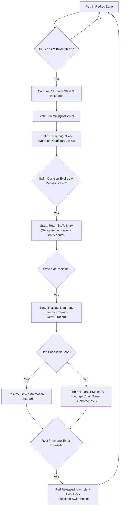

# 🏊 ForceSwimmingPeds for Grand Theft Auto V

[-blue.svg)](#)
[](https://github.com/scripthookvdotnet/scripthookvdotnet)
[](https://github.com/Lemon-UI/LemonUI)
[](#)
[](#)
[](https://github.com/TheZenHippie/AdvancedPedStudio)

**ForceSwimmingPeds** is an advanced ambient swimming director, pool zone manager, and relaxation coordinator for **Grand Theft Auto V**. Built with C#, **Script Hook V .NET v3**, and **LemonUI**, it breathes vibrant, realistic life into any swimming pool, mansion pool, beach, pond, or body of water across San Andreas.

Instead of endlessly swimming or escaping the area on foot, nearby NPCs and custom characters dynamically enter the water, swim and tread for a customizable duration, navigate back to the exact poolside point where they entered, exit the water, and seamlessly resume their pre-swim activity (sunbathing, dancing, lounging, or ambient scenarios) with full immunity cooldowns.

ForceSwimmingPeds is designed to operate as a standalone mod or as the dedicated swimming companion to [**AdvancedPedStudio**](https://github.com/TheZenHippie/AdvancedPedStudio).

---

## 📖 Table of Contents

1. [🌟 Key Features](#-key-features)
2. [🔄 Swimming Lifecycle & State Machine](#-swimming-lifecycle--state-machine)
3. [📋 Prerequisites & Installation](#-prerequisites--installation)
4. [🎮 Controls & Hotkeys](#-controls--hotkeys)
5. [🚶 Step-by-Step Walkthrough](#-step-by-step-walkthrough)
   - [Step 1: Open Menu & Survey the Area](#step-1-open-menu--survey-the-area)
   - [Step 2: Place the Swimming Center & Radius](#step-2-place-the-swimming-center--radius)
   - [Step 3: Fine-Tune Coordinates (Optional)](#step-3-fine-tune-coordinates-optional)
   - [Step 4: Configure Swim Chance & Timing Sliders](#step-4-configure-swim-chance--timing-sliders)
   - [Step 5: Save to a Friendly Location Profile](#step-5-save-to-a-friendly-location-profile)
   - [Step 6: Enable Swimming Behavior](#step-6-enable-swimming-behavior)
   - [Step 7: Recalling Swimmers](#step-7-recalling-swimmers)
6. [🤝 Integration with AdvancedPedStudio](#-integration-with-advancedpedstudio)
7. [📱 LemonUI Interface Layout](#-lemonui-interface-layout)
8. [📁 Configuration & INI Schema](#-configuration--ini-schema)
9. [🛠️ Building from Source](#️-building-from-source)
10. [❓ Troubleshooting & FAQ](#-troubleshooting--faq)
11. [📜 Credits & License](#-credits--license)

---

## 🌟 Key Features

- **3D Semi-Transparent Green Dome Visual Aid:** When adjusting center coordinates or radius, an intuitive, semi-transparent green 3D dome renders in real time over the water, providing an exact, uncluttered visual representation of the active trigger zone.
- **Interactive Screen Raycasting ("Pick on Screen"):** Click anywhere in the 3D viewport or pool surface to cast a camera ray through map geometry and water planes, instantly snapping the center marker to that exact 3D world position.
- **Multi-Location Profile Manager:** Save unlimited custom locations with friendly names (e.g. *Michael's Pool*, *Del Perro Beach*, *Vinewood Hills Mansion*, *Lake Vinewood*). Switch active zones instantly, teleport to any center point, or rename and delete profiles directly in-game.
- **Persistent Menu & Full Movement Freedom:** LemonUI menus remain open until explicitly closed by pressing `Backspace` or your designated menu key (`F5`). Walk, sprint, and look around freely with mouse or gamepad while inspecting the placement of your radius marker.
- **Accidental Fire & Punch Suppression:** Weapon firing, aiming, and melee controls are automatically suppressed each frame while menus are open, allowing you to click, look around, and navigate without disturbing NPCs.
- **Realistic Periodic Swimming Cycles:** Peds do not swim forever. Each ped swims for an adjustable time (`Swim Duration`, 15s–300s, default 45s) with personalized $\pm 5$s variance to ensure staggered, natural exits.
- **Precision Return to Entry Point:** Upon finishing their swim cycle, peds calculate a navigation path back to the exact poolside or shoreline coordinate where they originally entered the water, preventing them from wandering aimlessly or walking away.
- **Pre-Swim Task & Routine Restoration:** The script inspects what each ped was doing before entering the water:
  - **Looping Animations & Poses:** Automatically re-triggers the ped's previous looping animation dictionary and clip.
  - **Ambient Scenarios:** Detects and restarts ambient world scenarios.
  - **No Prior Task (Idle Peds):** Commands the ped to utilize the nearest ambient scenario node within 25m (sunbathing towel, lounge chair, bench, chair) for the configured rest duration. If no node exists nearby, automatically initiates a poolside towel sunbathing routine on the deck.
- **Configurable Immunity Cooldown:** Peds remain immune to forced swim triggers for an adjustable rest period (`Rest / Immune Time`, 10s–300s, default 30s). Once the rest period expires, they naturally become eligible to swim again.
- **One-Click Recall Swimmers:** Highlighted yellow button immediately commands all active swimmers in the pool to exit the water and return to their entry points.

---

## 🔄 Swimming Lifecycle & State Machine



---

## 📋 Prerequisites & Installation

### Requirements

| Requirement | Purpose | Download |
| :--- | :--- | :--- |
| **Script Hook V** | Core GTA V native hook (`ScriptHookV.dll`) | [dev-c.com](http://www.dev-c.com/gtav/scripthookv/) |
| **Script Hook V .NET v3** | C# .NET scripting backend (`ScriptHookVDotNet3.dll`) | [GitHub Releases](https://github.com/scripthookvdotnet/scripthookvdotnet/releases) |
| **LemonUI for SHVDN3** | Responsive menu framework (`LemonUI.SHVDN3.dll`) | [GitHub Releases](https://github.com/Lemon-UI/LemonUI/releases) |
| **.NET Framework 4.8** | Windows .NET Runtime | [Microsoft](https://dotnet.microsoft.com/download/dotnet-framework/net48) |
| **AdvancedPedStudio** *(Recommended)* | 3D Ped Customizer & Spawner | [GitHub](https://github.com/TheZenHippie/AdvancedPedStudio) |

### Installation Steps

1. Locate your Grand Theft Auto V root installation directory (where `GTA5.exe` is located).
2. Ensure **Script Hook V** and **Script Hook V .NET v3** are installed:
   - `ScriptHookV.dll`, `ScriptHookVDotNet.asi`, and `ScriptHookVDotNet3.dll` belong directly in the **main GTA V root directory**.
   > [!IMPORTANT]
   > Core SHVDN files must never be placed inside the `scripts/` folder.
3. Open or create the `scripts/` folder inside your GTA V installation directory.
4. Copy **`ForceSwimmingPeds.dll`** and **`ForceSwimmingPeds.ini`** into the **`scripts/`** folder:
   ```text
   Grand Theft Auto V/ (Root Directory)
   ├── GTA5.exe
   ├── ScriptHookV.dll
   ├── ScriptHookVDotNet.asi
   ├── ScriptHookVDotNet3.dll
   └── scripts/
       ├── LemonUI.SHVDN3.dll
       ├── ForceSwimmingPeds.dll
       ├── ForceSwimmingPeds.pdb         (Optional, for debugging)
       └── ForceSwimmingPeds.ini
   ```
5. Launch Grand Theft Auto V (Story Mode).

---

## 🎮 Controls & Hotkeys

### Menu Navigation

| Key | Action | Description |
| :--- | :--- | :--- |
| **F5** *(Default)* | **Toggle Menu** | Opens or cleanly closes all ForceSwimmingPeds menus. Saves settings on close. |
| **Backspace** | **Back / Close** | Steps back up the submenu hierarchy; closes the root menu when at top level. |
| **Up / Down Arrow** | **Navigate Menu** | Scroll between items in the active menu. |
| **Left / Right Arrow** | **Adjust Sliders** | Increase or decrease slider values (Radius, Swim Chance, Timing, Coordinates). |
| **Enter** | **Activate / Direct Input** | Executes button action, toggles checkboxes, or opens direct keyboard input for sliders. |
| **W / A / S / D** | **Player Movement** | Walk, run, or position your character while the menu and visual aid remain open. |
| **Mouse / Right Stick**| **Rotate Camera** | Freely inspect pool boundaries and radius dome from any camera angle. |

### "Pick on Screen" Mode

| Key / Control | Action | Description |
| :--- | :--- | :--- |
| **Mouse Hover** | **Aim Crosshair** | Move the crosshair across the game viewport. |
| **Left Mouse Button** | **Confirm Position** | Raycasts to ground/water geometry, locks the center coordinate, and returns to the menu. |
| **Page Up / Num +** | **Expand Radius** | Increases radius marker size by +2.0m on the fly. |
| **Page Down / Num -** | **Shrink Radius** | Decreases radius marker size by -2.0m on the fly. |
| **Escape / F5** | **Cancel Picking** | Cancels raycast mode without changing coordinates and reopens the menu. |

---

## 🚶 Step-by-Step Walkthrough

### Step 1: Open Menu & Survey the Area
1. Travel to any swimming pool, mansion, or beach (e.g. Michael's backyard pool in Rockford Hills).
2. Press **F5** to display the **Force Swimming Peds** menu.
3. Notice that you can freely walk around (WASD) and rotate your camera to view the pool area.

### Step 2: Place the Swimming Center & Radius
1. On the main menu, select **`Pick on Screen`** and press **Enter**.
2. A crosshair will appear on your screen. Point the cursor toward the center of the water pool.
3. While aiming, use **Page Up** or **Page Down** to adjust the radius to match your pool's size.
4. **Left Click** on the water surface.
5. The menu will reopen, and a semi-transparent green 3D dome will appear, clearly marking the exact radius boundary.

### Step 3: Fine-Tune Coordinates (Optional)
1. If you wish to nudge the center coordinate slightly:
   - Select **`Advanced Settings ->`** $\rightarrow$ **`Coordinates ->`**.
2. Use the **X, Y, and Z Coordinate** sliders to nudge the marker by $\pm 0.5\text{m}$ in real time.
3. You can also press **Enter** on any coordinate slider to type an exact map coordinate.
4. Select **`Update Location`** to commit changes to the active profile.

### Step 4: Configure Swim Chance & Timing Sliders
From the main menu, fine-tune behavior:
- **`Area Radius: <X>m`**: Overall trigger radius (5m to 200m).
- **`Swim Chance: <X>%`**: Percentage probability that an eligible ped in range will start swimming (1% to 100%).
- **`Rest / Immune Time: <X>s`**: Length of time peds rest on deck before becoming eligible to swim again (10s to 300s, default 30s).
- **`Swim Duration: <X>s`**: How long peds swim and tread in the pool before heading back to the deck (15s to 300s, default 45s).
> [!TIP]
> Press **Enter** on any slider item to type an exact number on your keyboard.

### Step 5: Save to a Friendly Location Profile
1. On the main menu, select **`Save Location As...`** and press **Enter**.
2. Type a friendly name into the on-screen prompt (e.g. `Michael's Backyard Pool`) and press Enter.
3. Your coordinates, radius, swim chance, and timing parameters are saved to `ForceSwimmingPeds.ini`.
4. You can create as many location profiles as you wish and switch between them using the **`Location`** list slider.

### Step 6: Enable Swimming Behavior
1. Toggle the **`Enable Swimming Behavior [X]`** checkbox on.
2. Any NPC or spawned character walking into the radius will now periodically jump or wade into the water, swim around the center, return to their towel/entry point, and relax.

### Step 7: Recalling Swimmers
- **Manual Recall Button**: Select **`~y~Recall All Swimmers~s~`** on Row 2 to call all active swimmers back to their deck entry points immediately.
- **Unchecking Enabled**: Unchecking the **`Enable Swimming Behavior`** checkbox also automatically triggers a full swimmer recall.

---

## 🤝 Integration with AdvancedPedStudio

[**AdvancedPedStudio (APS)**](https://github.com/TheZenHippie/AdvancedPedStudio) is a premier 3D ped customization studio, wardrobe manager, and animation testing suite for GTA V.

ForceSwimmingPeds includes direct cross-script integration with **AdvancedPedStudio**:

```text
┌─────────────────────────┐          ┌─────────────────────────┐
│   AdvancedPedStudio     │          │    ForceSwimmingPeds    │
│  (Wardrobe & Spawner)   │          │   (Pool Zone Director)  │
├─────────────────────────┤          ├─────────────────────────┤
│ • Styles clothing/props │          │ • Reads APS Decorators  │
│ • Assigns looping dance │          │ • Directs ped into pool │
│ • Tags entity with      │          │ • Swims for duration    │
│   APS Decorators        │          │ • Returns to poolside   │
│ • Spawns ped poolside   │ ───────> │ • Resumes exact APS     │
└─────────────────────────┘          │   dance / pose / workout│
                                     └─────────────────────────┘
```

### How They Work Together
1. In **AdvancedPedStudio**, design a custom character (e.g. swimwear, sunglasses).
2. In APS **Step 2**, assign an animation loop or scenario (e.g. sunbathing on a towel, yoga, a nightclub dance, or a lounge pose) and save the profile.
3. In APS **Step 3**, spawn the character on your pool deck.
4. APS automatically tags the entity with game engine decorators:
   - `APS_HasTaskLoop` (bool)
   - `APS_TaskType` (int: 1 = Animation, 2 = Scenario, 0 = None)
   - `APS_ProfileHash` (int hash of friendly profile name)
5. When `ForceSwimmingPeds` triggers the ped into the pool, it preserves this metadata.
6. Upon completing their swim and returning to poolside, the ped **instantly resumes their custom dance, workout, or sunbathing routine**!

Check out the repository here: [**TheZenHippie/AdvancedPedStudio**](https://github.com/TheZenHippie/AdvancedPedStudio).

---

## 📱 LemonUI Interface Layout

The main menu is designed with an overflow-free, 10-row layout that fits completely on-screen without requiring scrolling:

```text
┌─────────────────────────────────────────────────────────┐
│ Force Swimming Peds                                     │
│ Swimming Location & Behavior                            │
├─────────────────────────────────────────────────────────┤
│ [✓] Enable Swimming Behavior                            │ Row 1
│ ~y~Recall All Swimmers~s~                               │ Row 2 (Yellow highlight)
│ < Location: Michael's Pool >                            │ Row 3 (Profile switcher)
│ Save Location As...                                     │ Row 4 (Name prompt)
│ Pick on Screen                                          │ Row 5 (Raycast marker)
│ < Area Radius: 18m >                                    │ Row 6 (5m - 200m)
│ < Swim Chance: 25% >                                    │ Row 7 (1% - 100%)
│ < Rest / Immune Time: 30s >                             │ Row 8 (10s - 300s)
│ < Swim Duration: 45s >                                  │ Row 9 (15s - 300s)
│ Advanced Settings                                   >   │ Row 10 (Submenu)
└─────────────────────────────────────────────────────────┘
   │
   ├── Teleport to Center
   ├── Coordinates -> [X, Y, Z sliders + Update Location]
   └── Manage Locations -> [Teleport To, Rename, Delete]
```

---

## 📁 Configuration & INI Schema

Settings and location profiles are saved in **`ForceSwimmingPeds.ini`**:

```ini
[Settings]
; Hotkey to toggle menu (Default: F5)
MenuKey=F5
; Currently active profile
ActiveLocation=Michael's Pool
; Global activation state
Enabled=true
; Global timing fallbacks (seconds)
RestDuration=30
SwimDuration=45

[Location:Michael's Pool]
CenterX=-811.230
CenterY=175.450
CenterZ=71.850
Radius=18.0
SwimChance=25
RestDuration=30
SwimDuration=45

[Location:Del Perro Beach]
CenterX=-1845.620
CenterY=-1195.340
CenterZ=19.180
Radius=65.0
SwimChance=15
RestDuration=60
SwimDuration=90
```

---

## 🛠️ Building from Source

### Requirements
- **Visual Studio 2022** or the **.NET SDK** (targeting .NET Framework 4.8).
- `ScriptHookVDotNet3.dll` and `LemonUI.SHVDN3.dll` referenced from your GTA V development path.

### Build via Command Line
```powershell
dotnet build "ForceSwimmingPeds.csproj" -c Release -p:Platform=x64
```

The post-build script will automatically copy the compiled `ForceSwimmingPeds.dll` to your configured GTA V `scripts/` directory.

---

## ❓ Troubleshooting & FAQ

**Q: The menu closes when I click on the screen.**  
**A:** This issue was resolved in the latest release (`CloseOnInvalidClick = false`). Ensure you have the latest compiled `ForceSwimmingPeds.dll` installed in your `scripts/` folder.

**Q: Peds swim away and never come back to the pool.**  
**A:** Ensure your `Swim Duration` slider is set to a reasonable time (e.g. 30s–60s). Peds will automatically swim back to their poolside entry coordinate when their timer ends.

**Q: Can I set up multiple swimming areas on the map?**  
**A:** Yes! Use **`Save Location As...`** to save as many locations as you want (e.g. your house, a beach club, a mansion pool). Use the **`Location`** slider on the main menu to switch between them.

**Q: Will this conflict with AdvancedPedStudio?**  
**A:** Not at all—they are built to complement each other! `ForceSwimmingPeds` specifically looks for `AdvancedPedStudio` decorators and restores custom animations and outfits automatically.

---

## 📜 Credits & License

- **Author:** TheZenHippie
- **Script Hook V:** Alexander Blade
- **Script Hook V .NET:** crosire & SHVDN Contributors
- **LemonUI:** Lemon / justalemon
- **Companion Mod:** [AdvancedPedStudio](https://github.com/TheZenHippie/AdvancedPedStudio)

Licensed under the [MIT License](LICENSE).

